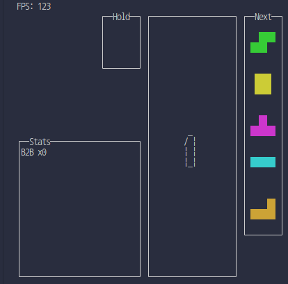
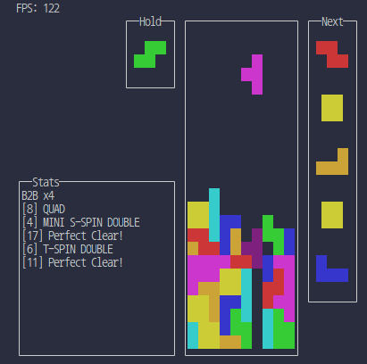

<div id="toc">
  <ul style="list-style: none;" align="center">
    <summary>
      <h1>tetrinal</h1>
    </summary>
  </ul>
</div>

<p align="center"><i>Simulate no-gravity stacking block in your terminal. Supports SRS, damage system, all spins, bag randomizer, and more.</i></p>

## Overview

`tetrinal` is a terminal-based block stacking simulation that focuses on "no-gravity" zen play. It supports lot of mechanics.

## Features

- **No-Gravity Stacking:** Play at your own pace, no gravity pressure.
- **SRS & All Spins:** Full support for SRS kicks and spin recognition.
- **Damage System:** Configurable damage and line clear rules.
- **Bag Randomizer:** True 7-bag shuffling for piece distribution.
- **Terminal UI:** Runs natively in your terminal with minimal dependencies.
- **Statistics:** Track your clears, spins, attack, and more.

</br>
<p align="center"><span style="font-size:1.5em;"><b>&#x26A0;&#xFE0F; This project is a work in progress &#x26A0;&#xFE0F;</b></span></p>

### Planned Features
- **Perfect Clear Practice:** Practice mode for perfect clears.
- **Custom Game Modes:** Create and play custom game modes.
- **Main Menu:** A main menu for easier navigation.
- **Customizable Settings:** More options for customizing gameplay.

## How to Build

You need a C++20 (or higher).

```bash
git clone https://github.com/qluana7/tetrinal.git
cd tetrinal
mkdir build && cd build
# you can use 'GNU make' instead of ninja
cmake .. -GNinja --DCMAKE_BUILD_TYPE=Release
ninja
```

The executable will be built in the `build` directory.

## How to Play

Run the program:

```bash
./tetrinal
```

Controls (default):

- **Left/Right:** Move piece
- **Down:** Soft drop
- **Up:** Rotate Clock Wise
- **Z:** Rotate Counter Clock Wise
- **A:** Rotate 180 degrees
- **C:** Hold
- **Space:** Hard drop
- **ESC:** Quit

(You can check in-source comments or configuration files for custom key mappings.)

## Image



## Contributing

Feel free to open issues, suggest features, or submit pull requests! Please follow standard C++ coding conventions and include usage comments for new features.

---
